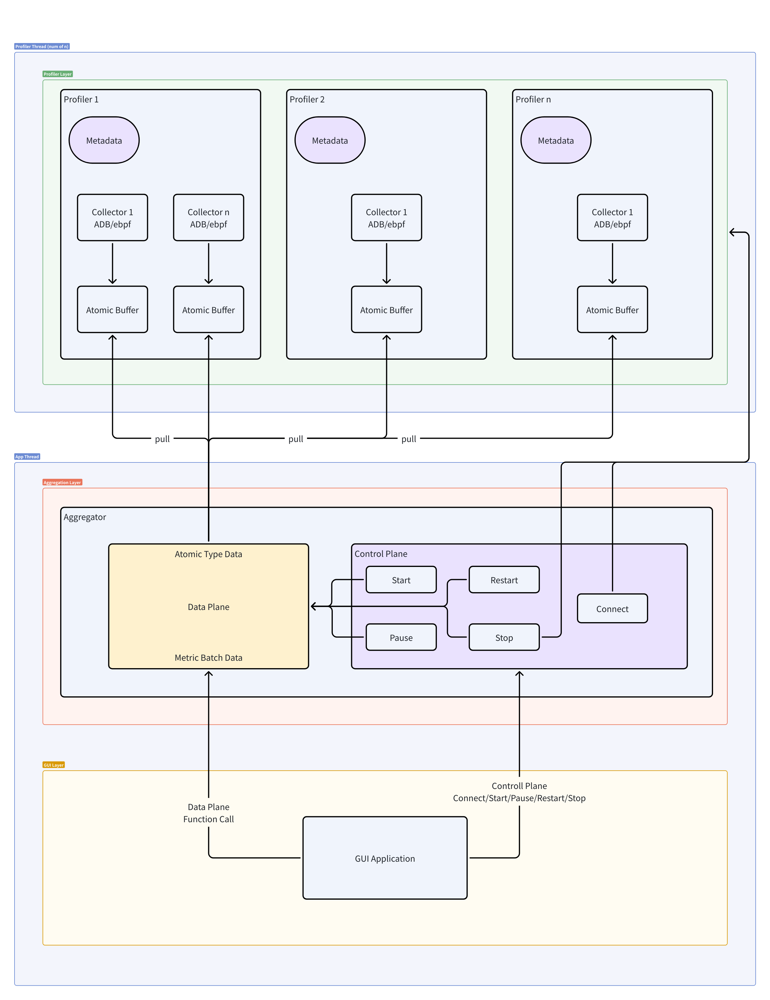
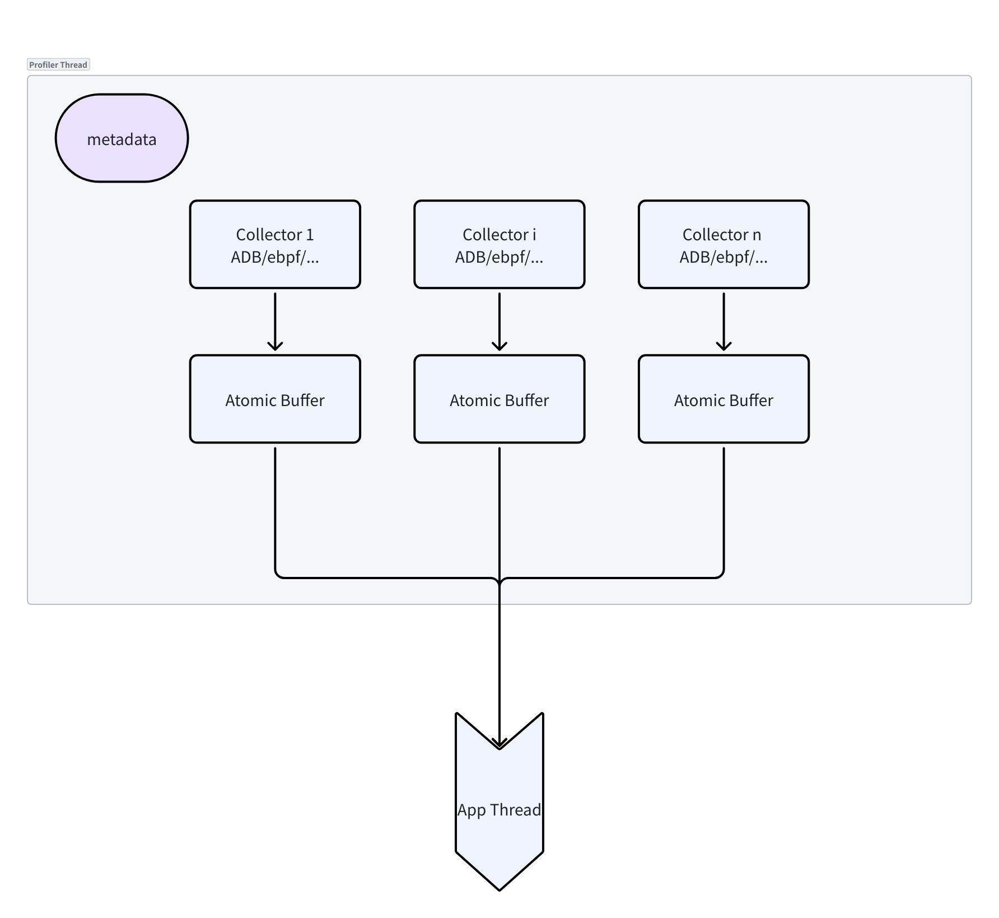

# PerfDroid

[中文文档 (Chinese README)](README.zh-CN.md)

PerfDroid is an open-source desktop tool for Android performance profiling. It focuses on low-intrusion metric collection, aggregation, visualization, and export from the PC side through ADB. The project is organized as a Rust workspace with an extensible profiler architecture.

## Overview

Mobile apps, especially mobile games, are sensitive to metrics such as FPS, CPU clock, CPU usage, temperature, and power. PerfDroid aims to provide a free, open, and extensible Android performance testing foundation for education and research scenarios.

Instead of running heavy logic on the phone, PerfDroid moves most of the collection pipeline to the PC side:

- Communicate with Android devices through ADB
- Collect different metrics with independent profiler modules
- Aggregate data into a unified structure
- Handle visualization, session control, and export at the application layer

## Planned Capabilities

- Android device detection and connection
- Session controls: `Connect`, `Start`, `Pause`, `Restart`, `Stop`
- Multi-metric collection:
  - FPS
  - CPU Clock
  - CPU Usage
  - Temperature
  - Power
- Real-time aggregation and chart rendering
- Session export (CSV / JSON / PNG / HTML)

## Architecture

PerfDroid follows a 3-layer structure:

- `Profiler Layer`: independent metric collectors that read device/system sources
- `Aggregation Layer`: reads latest profiler outputs and builds standardized `MetricBatch`
- `GUI Layer`: visualization, control, session management, and export

Thread model: `1 + n`

- `1` app thread for aggregation and top-level control
- `n` profiler threads for metric collection



Profiler layer design emphasizes modularity and low coupling. In practice, each metric can evolve as an independent crate:



## Repository Layout

```text
PerfDroid/
├── crates/
│   ├── app/                    # App layer
│   ├── pdcore/                 # Core abstractions, types, errors, constants
│   ├── registry/               # Profiler registration and metadata
│   └── profiler/
│       ├── cpu_clock/
│       ├── cpu_usage/
│       ├── fps/
│       ├── power/
│       └── temperature/
├── docs/
│   ├── tech_doc.md             # Technical design document
│   └── images/                 # Architecture diagrams and images
└── Cargo.toml                  # Rust workspace config
```

## Requirements

- Rust stable
- Cargo
- [`just`](https://github.com/casey/just) (task runner for dev/build/package commands)

## Common Development Commands

A root-level `justfile` is provided:

```bash
just --list
just check
just test
just run
just clippy
```

## Build Release Packages (Windows / Linux / macOS)

Install Rust targets first:

```bash
just install-targets
```

Package per platform:

```bash
just package-linux
just package-macos
just package-windows
```

Package all platforms:

```bash
just package-all
```

Artifacts are generated under `dist/`, for example:

- `perfdroid-0.1.0-linux-x86_64.tar.gz`
- `perfdroid-0.1.0-macos-x86_64.tar.gz`
- `perfdroid-0.1.0-windows-x86_64.zip`

Each release package includes platform-specific bundled ADB binaries in `adb/`:

- Linux: `adb/adb`
- macOS: `adb/adb`
- Windows: `adb/adb.exe` + `AdbWinApi.dll` + `AdbWinUsbApi.dll`

## ADB Permission Notes (Linux / macOS)

If executable permission is lost after extracting archives or moving filesystems, you may see `Permission denied`. Fix with:

```bash
chmod +x adb/linux/adb adb/mac/adb
```

## License

This project is licensed under Apache-2.0. See [`LICENSE`](LICENSE).
