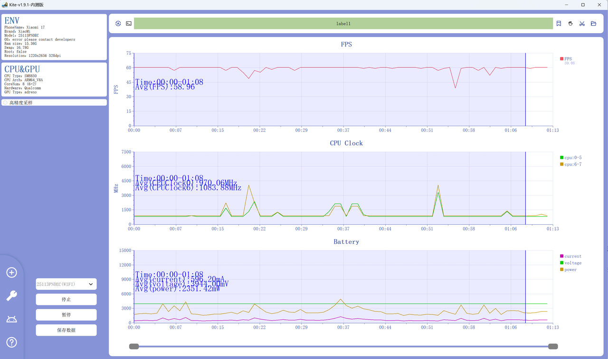

# PerfDroid 开发技术文档

# Part00 文档规范
- Doc Version 1.3
- Update at 2026-05-15 (for main/1.0.0)

## 0.1 文档用词统一标准
| 用词 | 含义 |
|---|---|
| Profiler Layer | 软件三层体系结构的最底层，为各类指标采集器所在层。 |
| Aggregation Layer | 软件三层体系结构的中间层，为各类采集器数据汇集后的所在层。 |
| GUI Layer | 软件三层体系结构的最顶层，为结构化数据后进行可视化和数据分析的层级。 |
| Profiler Thread | 每个 Profiler 都会创建一个独立的线程，它们都处于 Profiler Layer 中，主管数据的采集。 |
| Application Thread | 由 Aggregation Layer 和 GUI Layer 共同构成的线程，主管数据的传递、渲染、分析与控制。 |
| Profiler | Profiler Layer 中的每一个 Profiler，负责一个指标的所有采集任务。由两个部分组成：（1）Collector；（2）Atomic Buffer。 |
| Collector | Profiler 的一个组件，负责直接对接物理设备的数据采集，如 adb、eBPF 等。 |
| Atomic Buffer | Profiler 的一个组件，缓存采集的数据，并以原子数据类型的形式存储。 |
| Aggregator | Aggregation Layer 的核心组件，负责读取、控制和传递从 Profiler 获取的数据。由两个部分组成：（1）Data Plane；（2）Control Plane。 |
| Data Plane | Aggregator 的一个平面，以数据的读取、处理和传递为主要任务。 |
| Control Plane | Aggregator 的一个平面，以数据的控制为主要任务，分为 5 个控制流：Connect、Start、Pause、Restart、Stop。 |
| Session | 一次从连接设备到开始采样、暂停、恢复、停止并最终导出的完整测试过程。 |
| Metric | 一个可被系统采集、展示、导出的性能指标，如 FPS、CPU_CLOCK、TEMP、POWER。 |
| Metric Batch | 某一时刻、某一指标的一组结构化采样结果。 |
| Device Descriptor | 对被测设备的识别描述，包括设备 ID、连接方式、型号、Android 版本等信息。 |
| Exporter | GUI Layer 中负责将会话数据导出（当前版本支持 CSV / JSON / HTML / PNG）的模块。 |
| Data Part | GUI Layer 中负责图表展示、数据列表展示、会话数据管理、时间区间删除与导出前数据预处理的功能区域。 |
| Control Part | GUI Layer 中负责用户控制操作的功能区域，用于触发 Start、Pause、Restart、Stop、Export 等命令，并管理采样参数与测试流程。 |
| Device Part | GUI Layer 中负责设备识别、设备选择、连接方式展示与设备基础信息展示的功能区域。 |

## 0.2 专有名词解释
### 0.2.1 ADB
- Android Debug Bridge。Android 提供的调试桥接工具，可由 PC 侧对设备进行 shell 指令执行、文件访问、属性读取与端口通信。PerfDroid 的主要外部采集链路建立于 ADB 之上。

### 0.2.2 Sampling Rate
- 采样率，即单位时间内系统从 Profiler 读取数据的频率，通常用 Hz 表示。例如 10 Hz 表示每秒采样 10 次。

### 0.2.3 Refresh Rate
- 刷新率，指 GUI 图表的渲染更新频率。刷新率不一定等于采样率；在高采样率场景下，可采用降频渲染以减轻界面压力。

### 0.2.4 Cluster
- CPU 核心分组。移动 SoC 常将 CPU 按性能与功耗特性划分为多个 cluster，例如小核簇、大核簇、超大核簇。不同 cluster 往往对应不同的频率策略文件。

### 0.2.5 SoA
- Structure of Arrays，一种面向缓存友好的数据布局方式。相较于 AoS（Array of Structures），SoA 更有利于批量读取同类数值字段。

### 0.2.6 Sentinel Value
- 哨兵值。本文中统一规定 `-1` 代表“当前数据无效、不可用、未启用或本周期采集失败”。

### 0.2.7 Session State
- 会话状态。PerfDroid 将一次测试抽象为若干状态切换，例如 `Disconnected`、`Connected`、`Running`、`Paused`、`Stopped`。

## 0.3 文档编写约定
- 所有结构名称、模块名称、线程名称均使用英文首字母大写的术语形式。
- 所有指标键名（metric_key）统一使用全大写蛇形风格，例如：
  - `FPS`
  - `CPU_CLOCK`
  - `CPU_USAGE`
  - `GPU_CLOCK`
  - `BATTERY_TEMP`
- 单位字段（unit）统一采用简洁字符串表示，例如：
  - `FPS`
  - `MHz`
  - `%`
  - `mW`
  - `mA`
  - `mV`
  - `°C`
- 如无特殊说明，时间戳统一使用毫秒级 Unix Timestamp。当前 CSV 导出使用相对时间（`time_s`，单位秒）作为时间列。
- 如无特殊说明，所有示例代码均为说明性伪代码或 Rust 风格伪代码，不保证可直接编译。

# Part01 项目背景与目标
## 1.1 概述
- 移动游戏已成为全球娱乐产业中最重要的组成部分之一，这对开发人员和质量保证工程师提出了更高要求：他们必须对真实 Android 设备上的游戏性能进行持续、可量化、可复现的观测。帧率（FPS）、CPU 频率与利用率、设备温度、功耗、电流和电压等指标直接影响用户体验与系统稳定性。若缺乏可靠的性能数据，开发团队将难以定位瓶颈、评估优化效果，也无法在上线前建立充分信心。
- 现有工具存在两个根本障碍。第一是可访问性问题：主流方案如 Kite、PerfDog、Scene 要么闭源，要么商业化，学生团队、独立开发者和小型工作室很难长期负担，也无法根据自身研究目标进行定制。第二是技术架构问题：直接运行在被测设备上的工具会对 CPU、内存与功耗产生额外干扰，从而污染原始测试数据；而运行在 PC 侧的外部工具虽然可以降低干扰，但其内部实现通常不可见、不可扩展，也难以支撑社区协作与长期演化。
- 这两类问题共同造成了明显的市场空白：目前缺少一款同时满足“免费开源、低干扰、支持较高采样频率、可扩展、可导出、可视化”的 Android 游戏性能测试工具。
- PerfDroid 的目标正是填补这一空白。该项目计划实现为一个模块化的桌面应用程序，通过 ADB 从设备外部持续采集性能指标，在 PC 端完成数据聚合、实时展示与结果导出，从而尽量避免被测设备侧的额外负担。
- PerfDroid 不仅面向开发者，也面向课程项目、研究实验、测试团队与个人性能爱好者。其设计原则包括：**低侵入、强扩展、清晰架构、可验证实现、可持续演进**。


## 1.2 项目目标
### 1.2.1 核心目标
- 提供一套免费的、开源的 Android 性能测试工具。
- 通过 ADB 在设备外部完成指标采集，降低对被测设备的干扰。
- 支持多种核心性能指标的统一采集、展示与导出。
- 支持模块化扩展，使新指标能够通过新增 Profiler 的方式接入。
- 支持中高频率采样，满足实时图表展示与测试记录需求。

### 1.2.2 设计目标
- 架构清晰：将采集、聚合与可视化解耦。
- 线程职责明确：采集线程与主线程分工清晰。
- 数据结构统一：不同指标最终均被组装为一致的 Metric Batch。
- 可维护性强：便于团队并行开发与后续重构。
- 可验证性强：每个 Profiler 可独立测试其最大可用采样频率与稳定性。

## 1.3 项目范围
### 1.3.1 最低可行功能（MVP）
- 设备识别与连接（USB / WiFi）
- 会话控制（Connect / Start / Pause / Restart / Stop）
- 至少支持以下指标中的若干项：
  - FPS
  - CPU_CLOCK
  - CPU_USAGE
  - BATTERY_TEMP
- 实时图表展示
- CSV导出

### 1.3.2 期望功能
- 支持更多硬件与系统指标：
  - POWER
  - CURRENT
  - VOLTAGE
- 图表截图导出（PNG）
- 报告导出（HTML）
- 测试区间删除
- 多设备识别
- 指标开关配置
- 会话级元数据记录

### 1.3.3 基于 main 分支 1.0.0 的实现状态
- 已实现：
  - 设备识别与连接（USB / WiFi）
  - 会话控制（Connect / Start / Pause / Restart / Stop）
  - 指标采集：`FPS`、`CPU_CLOCK`、`CPU_USAGE`、`BATTERY_TEMP`、`VOLTAGE`、`CURRENT`、`POWER`
  - 实时图表展示
  - 会话导出：`CSV` / `JSON` / `HTML` / `PNG`
  - 测试区间删除
- 未在 1.0.0 中完整落地（保留为后续演进方向）：
  - 多设备并行测试
  - 指标开关的精细化配置面板
  - 更完整的会话级元数据管理

### 1.3.4 1.0.0 新增功能补充说明
- 采样频率支持在运行时调整，当前实现范围为 `1~10 Hz`。
- FPS 指标支持在 GUI 中配置目标应用包名，并在运行时同步到 FPS Profiler。
- 会话数据支持“按时间区间删除”，用于清理异常片段后再导出。
- 导出能力已扩展为 `CSV / JSON / HTML / PNG`，并统一要求在 `Paused` 或 `Stopped` 状态下触发。
- 图表支持交互式数据查看：
  - 支持查看某一时间点的具体指标值
  - 支持选择某一时间区间并查看统计数据（如均值、最小值、最大值）
  - 支持删除选中时间区间的数据

# Part02 软件体系结构
- 本部分对软件体系结构的描述采用自底向上的方式。

## 2.1 基础架构
- 软件整体采用三层分层体系结构：
  - Profiler Layer
  - Aggregation Layer
  - GUI Layer
- 在线程级上，软件采用 `1 + n` 的模型：
  - `1` 个 Application Thread：负责聚合、状态控制、GUI 数据投递与渲染触发
  - `n` 个 Profiler Thread：每个 Profiler 独占一个线程，负责其所属指标的持续采集
- 该架构的基本思想是：
  - **采集分散**：不同指标可独立并行采集，互不阻塞
  - **聚合统一**：所有指标统一由 Aggregator 收敛到标准结构
  - **显示独立**：GUI 不直接接触底层采集逻辑，仅接收标准化数据


## 2.2 整体数据流与控制流
### 2.2.1 数据流
- Collector 从设备或系统接口读取原始值
- 原始值写入 Atomic Buffer
- Aggregator 周期性读取 Atomic Buffer 中的最新值
- Aggregator 结合 ProfilerMetadata 组装为 Metric Batch
- Metric Batch 传递给 GUI Layer
- GUI Layer 将数据写入会话缓存并进行实时可视化

### 2.2.2 控制流
- GUI Layer 发起连接与采样控制命令
- Control Plane 接收命令并切换内部状态
- Control Plane 负责管理设备连接、Profiler 生命周期与采样启停
- 状态变化同步通知 GUI Layer，用于更新按钮状态、连接状态和导出可用性

## 2.3 Profiler Layer
- Profiler Layer 由多个 Profiler 组成。每个 Profiler 负责一个指标类别的采集。
- 每个 Profiler 在系统层面对应一个独立线程，在代码组织层面建议对应一个独立 crate 或模块。
- 一个 Profiler 负责如下职责：
  - 维护自身元数据
  - 初始化所需采集上下文
  - 周期性执行采集逻辑
  - 将最新采样结果写入 Atomic Buffer
  - 向 Aggregator 暴露只读的最新状态


### 2.3.1 Profiler 的组成
- 每个 Profiler 由以下两个核心组件构成：
1. **Collector**
   - 负责与设备或操作系统接口直接交互。
   - 将采样结果转化为统一数值。
2. **Atomic Buffer**
   - 用于保存“该 Collector 当前最新的值”。
   - 被 Profiler Thread 写入，被 Aggregator 所在主线程读取。

### 2.3.2 ProfilerMetadata
- 每个 Profiler 需要维护一份元数据，在初始化完成后传递给 Aggregator。
```rust
pub struct ProfilerMetadata {
    pub profiler_key: String,
    pub collector: Vec<CollectorMetadata>,
}
```
- 字段说明：
  - profiler_key：指标主键，例如 CPU_CLOCK、FPS
  - collectors：该 Profiler 下所有 Collector 的元数据，顺序必须固定
- 对应的 Collector 元数据如下：
```Rust
pub struct CollectorMetadata {
    pub collector_key: String,
    pub unit: String,
}
```
- 字段说明：
  - collector_key：子采集键，例如 policy0、policy6、main
  - unit：该采集器的单位

### 2.3.3 Collector & Atomic Buffer
- 每个 Collector 只采集一个数值。
- Collector 的输出统一写入原子缓冲区。
- 当前统一使用 AtomicI64 表示采样结果。
- 约定：
  - 当值为 -1 时，表示当前数据不可用、采样失败、该维度未启用或不存在。
  - 由于 Rust 标准原子类型目前不直接支持 f64，因此本项目暂时统一使用整数表达所有采样值。
- 例如：
  - 温度若需保留一位小数，可将 36.5°C 存储为 365，单位写为 0.1°C。
  - 电压若原始单位为伏特，可转为毫伏整数存。

### 2.3.4 对一些问题的回答
- Q: 原子类型缓冲区的目的是什么？
- A: 这是为了匹配Profiler和Aggregator之间的频率差异。假如用户以120Hz的频率去采样，但是Profiler的采集频率最大只有30Hz，如果没有缓冲区的话，那么Aggregator将会读到4次None。若存在缓冲区，那么Sampler将会读到不变的值，直到Profiler再次更新采集的数据。
- 不过因为这个设计的存在，大家在设计Profiler的时候需要留意一下性能问题，需要自己测试一下所设计模块的最大采集频率，至少保证5Hz吧。
- 后面前端GUI的技术路线选型也需要考虑一下性能问题，我怀疑基于Web技术栈的Tauri撑不住30Hz甚至更高的采集频率，可能要换GPUI才可以。
- Q:缓冲区为何一定是原子类型？
- A: 缓冲区内的数据将会被2个线程并发访问，为了避免data race，我们需要使用锁来保证同步。但是Mutex的性能损耗过高，而Rust提供了一种Atomic Type，其核心特点为内部值可以被多个线程并发访问、某些操作不会产生 data race、必须显式指定内存序 Ordering。和Mutex或OS锁不一样的是，Atomic Type 优先依赖 CPU 提供的原子指令，以及 LLVM 的原子内存模型。其可以直接使用在CPU层面的硬件同步机制，所以在保证线程安全的情况下也有良好的性能表现。

### 2.3.5 Profiler 的实现约束
- 每个 Profiler 在实现时应满足以下约束：
  - 不直接依赖 GUI 层类型
  - 不在采集线程内执行重型格式化逻辑
  - 尽量避免频繁分配内存
  - 必须给出可验证的最大稳定采样频率
  - 对异常情况必须写入 -1 而不是 panic
  - 初始化失败应向上返回明确错误，避免进入半连接状态

## 2.4 Aggregation Layer
- Aggregation Layer 的核心模块是 Aggregator。
- Aggregator 负责读取、控制和传递来自各个 Profiler 的数据。
- Aggregator 由两个 Plane 构成：
  - Data Plane：负责数据读取、组装、缓存与向上游传输
  - Control Plane：负责连接、状态切换、Profiler 生命周期与异常处理

### 2.4.1 Aggregator 的职责边界
- Aggregator 负责：
  - 接收 GUI Layer 发来的控制命令
  - 初始化与维护设备连接状态
  - 持有所有 Profiler 的元数据与缓冲区句柄
  - 周期性读取最新采样值
  - 组装统一的数据结构供 GUI 使用
  - 维护当前会话状态
- Aggregator 不负责：
  - 底层采集逻辑实现
  - GUI 图表绘制
  - 复杂分析算法
  - 报告模板渲染

### 2.4.2 Data Plane
- Data Plane 负责从每个 Profiler 的 Atomic Buffer 中读取数值，并结合元数据组装为统一的 MetricBatch。
- GUI Layer 不需要关心该值来自哪个设备文件、哪条 adb 指令、哪个 shell 输出，只接收标准化结构。
```Rust
pub struct MetricBatch {
    pub metric_key: String,
    pub unit: String,
    // SoA: Just the values. No String headers polluting the cache line.
    pub values: Vec<i64>, 
}
```
- 字段说明：
  - metric_key：指标主键
  - unit：统一单位
  - values：按固定顺序组织的数值数组，未使用槽位填 -1
#### 2.4.2.1 为什么采用固定长度 values
- 不同设备的 cluster 数、传感器数存在差异。
- 若 GUI 为每个指标使用动态长度结构，则会显著增加图表层的数据绑定复杂度。
- 因此本项目当前采用固定槽位设计。建议默认长度为 10，能够覆盖大多数移动设备常见的多 cluster / 多通道指标场景。
- 为了方便理解，此处我们将会给出三个案例方便大家理解数据流程。

#### 2.4.2.2 CPU_CLOCK（对于双cluster设备）
- 这里以Snapdragon 8 Elite Gen5为SoC的Android手机的CPU_CLOCK测试为例，其拥有2个cluster，CPU0-CPU5为第一个cluster；CPU6-CPU7为第二个cluster。
- 由于每部手机的cluster数量不一致，但是主流为不多于3个cluster。综合考虑各个维度的数据的不同情况，我们将values数组的长度定为10，这样可以满足绝大部分维度数据的需求。
- 因此当Aggregator从Profiler获取数据时，将会读取到该Profiler拥有2个Collector，每个Collector的Atomic Buffer的数据如下：
```Python
710, 1300, -1, -1, -1, -1, -1, -1, -1, -1
```
- 那么在Aggregation Layer，其最后将会被组装为如下的数据点
```Rust
let batch = MetricBatch {
    metric_key: "CPU_CLOCK".to_string(),
    unit: "Mhz".to_string(),
    values: vec![710, 1300, -1, -1, -1, -1, -1, -1, -1, -1],
};
```

#### 2.4.2.3 CPU_CLOCK（对于三cluster设备）
- 这里以MediaTek 9500为SoC的Android手机的CPU_CLOCK测试为例，其拥有3个cluster，CPU0-CPU3为第一个cluster；CPU4-CPU6为第二个cluster；CPU7为第三个cluster。
- 因此当Aggregator从Profiler获取数据时，将会读取到该Profiler拥有3个Collector，每个Collector的Atomic Buffer的数据如下：
```Python
710, 1300, 1457, -1, -1, -1, -1, -1, -1, -1
```
- 那么在Aggregation Layer，其最后将会被组装为如下的数据点
```Rust
let batch = MetricBatch {
    metric_key: "CPU_CLOCK".to_string(),
    unit: "Mhz".to_string(),
    values: vec![710, 1300, 1457, -1, -1, -1, -1, -1, -1, -1],
};
```

#### 2.4.2.4 FPS
- 不同于CPU_CLOCK，FPS不存在一个测试维度有多个值的情况。因此我们在设计FPS时，只设计了1个Collector。
- 因此当Aggregator从Profiler获取数据时，将会读取到该Profiler拥有1个Collector，每个Collector的Atomic Buffer的数据如下：
```Python
118, -1, -1, -1, -1, -1, -1, -1, -1, -1
```
- 那么在Aggregation Layer，其最后将会被组装为如下的数据点
```Rust
let batch = MetricBatch {
    metric_key: "FPS".to_string(),
    unit: "FPS".to_string(),
    values: vec![118, -1, -1, -1, -1, -1, -1, -1, -1, -1],
};
```

### 2.4.3 Control Plane
- Control Plane 负责整个会话生命周期管理。当前定义 5 个主控制流：
  - Connect
  - Start
  - Pause
  - Restart
  - Stop
- GUI 侧还提供 Export（CSV / JSON / HTML / PNG）动作。Export 不改变 SessionState，但受状态约束（仅 `Paused` / `Stopped` 允许）。
- Aggregator 中定义如下状态枚举：
```Rust
pub enum SessionState {
    Disconnected,
    Connected,
    Running,
    Paused,
    Stopped,
}
```

#### 2.4.3.1 Connect
- 作用：
  - 建立 ADB 有线或无线连接
  - 识别目标设备
  - 初始化设备上下文
  - 加载并注册所有 ProfilerMetadata
  - 创建并启动各个 Profiler Thread
  - 但此时 Aggregator 还不开始正式采样
- 说明：
  - Connect 完成后，系统状态从 Disconnected 进入 Connected
  - 
#### 2.4.3.2 Start
- 作用：
  - 启动采样循环
  - 按设定频率从各个 Profiler 的 Atomic Buffer 中拉取数据
  - 组装 MetricBatch
  - 向 GUI Layer 持续推送数据
- 说明：
  - Start 后，系统状态进入 Running

#### 2.4.3.3 Pause
- 作用：
  - 暂停采样
  - Aggregator 停止继续拉取数据
  - 保留当前设备连接与 Profiler Thread
  - 不清空已有会话缓存
- 说明：
  - Pause 后，系统状态进入 Paused

#### 2.4.3.4 Restart
- 作用：
  - 从暂停状态恢复采样
  - 延续原有设备连接和 Profiler 生命周期
  - 继续向 GUI Layer 推送数据
- 说明：
  - Restart 后，系统状态重新回到 Running

#### 2.4.3.5 Stop
- 作用：
  - 停止采样循环
  - 停止并回收 Profiler Thread
  - 释放连接资源
  - 固化当前 Session，使其可导出或清空
- 说明：
  - Stop 后，系统状态进入 Stopped
  - 若用户需要重新连接设备并重新创建会话，可再次执行 Connect

#### 2.4.3.6 Control Plane 状态约束
- 遵循如下状态流转规则：
```Text
Disconnected -> Connected -> Running -> Paused -> Running -> Stopped -> Connected
```
允许的操作关系如下：
| 当前状态	| 允许操作 |
|---|---|
| Disconnected | Connect |
| Connected | Start, Stop |
| Running | Pause, Stop |
| Paused | Restart, Stop, Export |
| Stopped | Connect, Export |

- 不允许的操作应直接返回错误，例如：
  - Disconnected 状态下执行 Start
  - Running 状态下再次执行 Connect
  - Paused 状态下再次执行 Pause
  - Running 状态下执行 Export

## 2.5 GUI Layer
- 前两层只负责数据采集与聚合，只有在 GUI Layer 中，数据才会被组织为适合渲染、交互和导出的形式。
- GUI Layer 负责：
  - 数据可视化
  - 用户交互
  - 会话内缓存
  - 数据裁剪
  - 数据导出
  - 设备与测试流程控制
- 为降低系统复杂度，当前版本建议采用单页面主界面，但内部逻辑分为三个功能区域：
  - Data Part
  - Control Part
  - Device Part

### 2.5.1 GUI Layer 的职责边界
- GUI Layer 负责：
  - 显示实时图表与数值卡片
  - 呈现设备信息与连接状态
  - 提供测试控制按钮
  - 管理会话内缓存
  - 管理导出流程
  - 管理用户侧的数据删除与筛选
- GUI Layer 不负责：
  - 直接采集设备数据
  - 直接控制底层 Collector 实现细节
  - 承担底层线程同步逻辑

### 2.5.2 会话内数据存储
- GUI Layer 应维护一份内存中的会话缓存，用于：
  - 图表绘制
  - 区间删除
  - 导出
  - 分析

### 2.5.3 Data Part
- Data Part 负责基于后端传输的数据绘制图表，并提供基础数据操作能力。
- 功能包括：
  - 多指标图表展示（当前包括 `CPU_CLOCK`、`CPU_USAGE`、`FPS`、`BATTERY_TEMP`、`VOLTAGE`、`CURRENT`、`POWER`）
  - 单指标多通道展示
  - 实时当前值展示
  - 单时间点数据查看
  - 时间区间统计数据查看
  - 时间区间数据删除
  - 会话数据导出（CSV / JSON / HTML / PNG）

### 2.5.4 Control Part
- Control Part 负责测试流程控制。
- 包含以下功能：
  - Start
  - Pause
  - Restart
  - Stop
  - Export（CSV / JSON / HTML / PNG）
- 此外还可配置：
  - 采样频率（Hz）
  - 被测试应用的包名（FPS模块将会依赖于此）
  - 导出路径（跨平台系统文件保存对话框）
  - 导出限制：仅 `Paused` 或 `Stopped` 状态允许导出

### 2.5.5 Device Part
- Device Part 负责设备识别与连接方式管理。
- 功能包括：
  - 展示当前可识别设备列表
  - Detect ADB Devices（触发设备发现）
  - 显示连接方式（USB / WiFi）
  - 允许用户选择目标设备
  - 执行 USB / Wireless 连接（Connect）
  - 展示设备基本信息：
    - 设备名称
    - 设备序列号
    - Android 版本
    - SoC / 型号（若可获得）
- 例如下拉框可提供：
  - Xiaomi 17 (USB)
  - Xiaomi 17 (WiFi)
